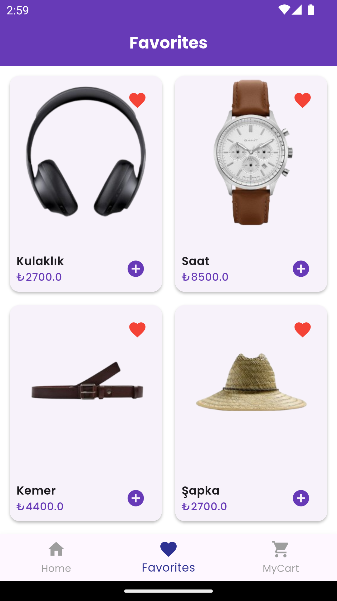
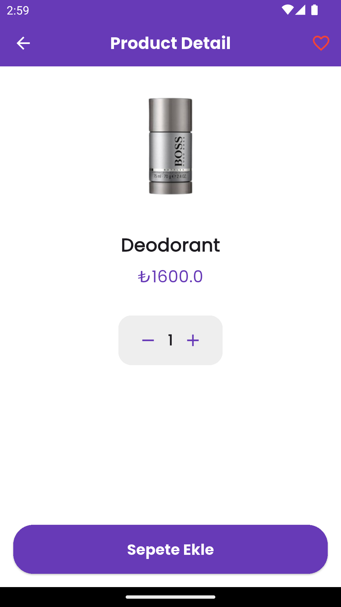

# Ecommerce App Demo Project

Flutter based mobile e-commerce application developed with a modern and clean design. Includes cart, favorite products and detailed product reviews.

---

## 🚀 Features

- Listing all products in **GridView** structure
- Product filtering with **Search feature**
- Smart cart integration:
- If the same product is added more than once, **the quantity is increased**
- Quantity and total price are shown on the product card
- Adding the product to the cart with **one click**
- Adding/removing from favorites
- Easy page transition with **BottomNavigationBar**
- Material 3 UI compatible design

---

### ❤️ Favorites

- List products added to favorites
- Remove from favorites
- Access to favorites from detail page

---

### 🛒 Basket

- Showing products added to the cart card by card
- Calculating the total amount according to the number of products
- Deleting products
- Completing the order with the "Confirm Cart" button
- Calculating the total cart amount

---

## 🧱 Technologies

- **Flutter** and **Dart**
- `flutter_bloc` state management **BLOC**
- Responsive design (mobile compatible)
- Stateless/Stateful widget architecture
- Offline demo work with local product list data
- Web Service API Usage (Restful Architecture, Json Parse)

---

## 📷 Screenshots

<table>
  <tr>
  
### 🏠 Home
 

### ❤️ Favorites
 

### 🛒 Cart
 

</tr>
</table>
---

## License

This project is created for educational purposes.

